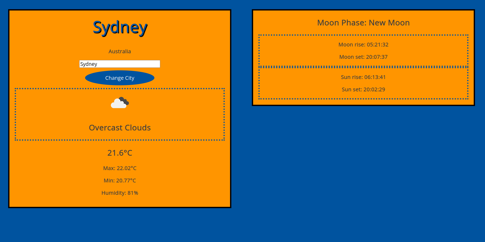

# Weather Checker
A website to check the current weather, as well as informations about the sun and the moon.  
You can type in a city and then see the current temperature, min. and max. temperature, weather und humidity.  
On the right you can see the current moonphase and sunrise, sunset and moonrise, moonset of the chosen city.  



## Spring Boot
This project uses Spring Boot to run the website on localhost:8080.  
Simply type in the following to run the project:
```console
./mvnw spring-boot:run
```
